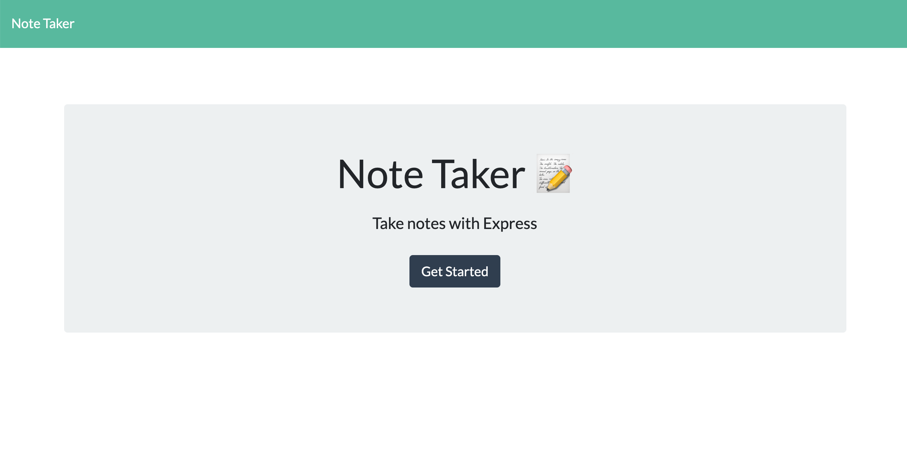

# Note Taker Starter Code

[JB BLOT - NOTE TAKER](https://github.com/jaaybe/Note_Taker)

## Description
I've created an application called Note Taker that can be used to write and save notes. This application uses an Express.js back end and saves and retrieve note data from a JSON file.

[Live Link via Heroku](https://powerful-reef-24889.herokuapp.com/)

## Technology Used
<ul>
<li>git</li>
<li>HTML</li>
<li>CSS</li>
<li>Javascript</li>
<li>Express</li>
<li>JSON</li>
<li>API</li>

